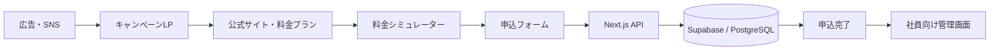
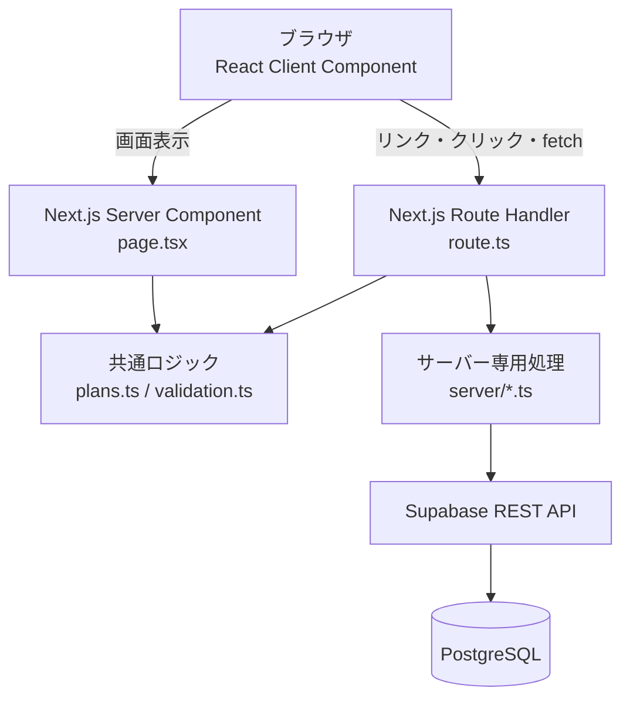
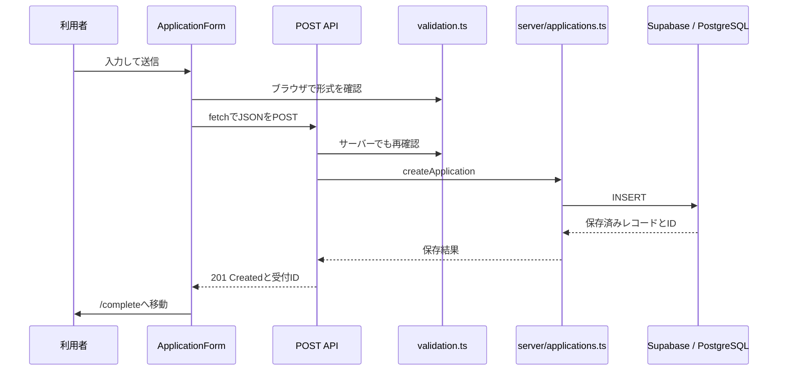

# LinkOne Mobile システム仕様書

この資料は、Web開発を始めた人がLinkOne Mobileの全体像を理解するための仕様書です。実際の契約・本人確認・回線開通・請求を行わない学習用ポートフォリオです。申込には架空の情報だけを使います。

## 1. このシステムで実現すること

通信サービスの「集客 → 検討 → 申込 → 社内管理」を、一つのWebシステムとして再現します。



デモモードでは、データベースだけがPC内の`.local/applications.json`に置き換わります。画面からAPIへ送る流れは本番モードと同じです。

## 2. 利用者と機能

| 利用者 | できること | 主な画面 |
| --- | --- | --- |
| 検討者 | サービスを知る、料金を見る、試算する、申込する | `/`、`/campaign`、`/plans`、`/simulator`、`/apply` |
| 申込後の利用者 | 受付番号を見る | `/complete?id=...` |
| 社員 | ログイン、申込確認、検索、状態変更 | `/admin`、`/admin/applications/[id]` |

申込の状態は`pending`（確認待ち）、`reviewing`（確認中）、`completed`（完了）の3つです。

## 3. 画面仕様

| URL | 目的 | 主な操作 | 実装ファイル |
| --- | --- | --- | --- |
| `/` | 公式トップ | 料金・試算・申込へ移動、FAQを開く | `src/app/page.tsx` |
| `/campaign` | 20GBキャンペーンLP | 試算・申込・公式サイトへ移動 | `src/app/campaign/page.tsx` |
| `/plans` | 料金プラン比較 | 選んだ容量で試算・申込へ移動 | `src/app/plans/page.tsx` |
| `/simulator` | 月額試算 | 容量、通話、サポートを選ぶ | `src/components/simulator.tsx` |
| `/apply` | 申込入力 | 選択確認、氏名・メール・電話を送信 | `src/components/application-form.tsx` |
| `/complete` | 受付結果 | 保存成功した同じブラウザで受付番号を表示 | `src/app/complete/page.tsx` |
| `/privacy` | デモ利用の説明 | 保存対象・注意点を読む | `src/app/privacy/page.tsx` |
| `/admin` | 社員用一覧 | ログイン、件数確認、検索、状態絞り込み | `src/app/admin/page.tsx` |
| `/admin/applications/[id]` | 申込詳細 | 情報を読み、対応状態を変更 | `src/app/admin/applications/[id]/page.tsx` |

`[id]`は動的ルーティングです。URLの最後にある受付番号だけを受け取り、同じ画面の形で別々の申込を表示します。

## 4. 使用する言語・技術

| 技術 | 何をするものか | このプロジェクトでの役割 |
| --- | --- | --- |
| HTML | 画面の意味と構造を表す言語 | 見出し、フォーム、表、リンクの土台 |
| CSS | 色、余白、配置を指定する言語 | `globals.css`と`design.css`で表示を作る |
| JavaScript | ブラウザ・サーバーで動く処理の言語 | クリック、送信、HTTP通信、計算 |
| TypeScript | JavaScriptに型を加えた言語 | プランIDや申込データの間違いを開発時に検出 |
| React | 画面を部品として組み立てる仕組み | フォーム、試算、管理操作を部品化 |
| Next.js | ReactのWebアプリ用フレームワーク | URLごとの画面、API、サーバー処理 |
| App Router | フォルダーでURLを作るNext.jsの仕組み | `app/plans/page.tsx`が`/plans`になる |
| Tailwind CSS | CSSの土台・ユーティリティを提供 | リセットと`sr-only`など。主な見た目はCSSファイル |
| Supabase | PostgreSQLを使いやすくするクラウドサービス | 本番時の保存先 |
| PostgreSQL | 表形式でデータを保存するDB | `applications`テーブルに申込を保存 |
| Vercel | Next.jsを公開するホスティング | 本番環境の実行場所として想定 |
| Git | 変更履歴を管理する仕組み | 修正内容をコミットとして残す |

フォーム、UI、状態管理用の外部ライブラリは使っていません。React標準の`useState`、ブラウザ標準の`fetch`、Next.js標準のRoute Handlerで実装しています。

## 5. フォルダーと責務

```text
src/
├─ app/           URLごとの画面とAPI
├─ components/    再利用する画面部品
└─ lib/           料金・入力検証などの共通ロジック
   └─ server/     秘密情報と保存を扱うサーバー専用処理
supabase/         PostgreSQLを作るSQL
docs/             学習資料と仕様書
tests/            ロジックの自動テスト
scripts/          起動済みアプリを確認するテスト
```

最初に読む順番は、`src/app/page.tsx` → `src/components/simulator.tsx` → `src/lib/plans.ts` → `src/components/application-form.tsx` です。画面、状態、料金、送信の順に理解できます。

## 6. システム構成と実行場所



ブラウザは利用者が操作する場所です。秘密鍵は置きません。Next.jsサーバーは検証・認証・DB通信を行います。データベースは、サーバーを止めても残したい申込情報を保存します。

### Server ComponentとClient Component

`page.tsx`は原則としてServer Componentです。サーバーで画面を準備するため、DBを読む処理を近くに書けます。`"use client"`が先頭にある`Simulator`や`ApplicationForm`はClient Componentです。クリック、`useState`、入力イベントをブラウザで扱います。

この違いは「画面」か「部品」かではなく、ブラウザ上で操作する必要があるかで決まります。

## 7. 料金シミュレーターの仕組み

料金は`src/lib/plans.ts`に一か所で定義します。

```text
通常月額 = 基本料金 + 通話オプション + サポート料金
初期月額 = 通常月額 - 1,000円
          （20GBスマートプランでキャンペーンを選んだ場合だけ）
```

`Simulator`は`useState`で現在の選択を持ちます。`useState`は、値が変わったときにReactへ画面を描き直すよう伝える機能です。選択が変わると`estimate`を呼び、見積もりの表示も変わります。

試算結果から申込へ進むと、`plan=smart&call=five`のようなURLクエリに選択値を入れます。個人情報はURLに入れません。申込ページでは`selection.ts`が既知の値だけを選び直します。

## 8. 申込から保存までの手順



1. `ApplicationForm`の`handleSubmit`が送信を受け取る。
2. `FormData`で氏名・メール・電話を読み、`validateApplication`で入力を確認する。
3. 問題なければ`fetch("/api/applications")`でJSONを送る。HTTPのPOSTは新しいデータを作る要求です。
4. `app/api/applications/route.ts`の`POST`が受け、Origin、回数、本文サイズ、入力をもう一度確認する。
5. `createApplication`が本番ではSupabase REST APIへ、デモではローカルファイルへ保存する。
6. APIは個人情報ではなく受付IDだけを201 Createdで返す。
7. 保存成功の証拠として、サーバーは署名付きCookieを返す。完了ページはIDとCookieの両方を確かめる。

ブラウザ側の検証だけでは、利用者がAPIへ直接データを送れてしまいます。そのため同じ検証をサーバー側でも行います。詳細なコード単位の説明は[REQUEST_FLOW.md](REQUEST_FLOW.md)を参照してください。

## 9. API仕様

APIは、画面とサーバー処理がHTTPで話すための窓口です。Requestはお願い、Responseは返事です。JSONはJavaScriptのオブジェクトを文字列でやり取りする形式です。

| HTTP | URL | Request | Response | 認証 |
| --- | --- | --- | --- | --- |
| POST | `/api/applications` | 申込情報JSON | `201 { id }` | 同一サイトからの送信を確認 |
| PATCH | `/api/applications/[id]` | `{ status }` | `200 { application }` | 社員Cookie・同一サイト |
| POST | `/api/admin/session` | `{ password }` | ログイン結果 | パスワード照合 |
| DELETE | `/api/admin/session` | なし | ログアウト結果 | 同一サイト |

HTTPステータスコードも返事の一部です。`201`は作成成功、`400`は入力不正、`401`はログインが必要、`403`は許可されない送信元、`404`は対象なし、`429`は短時間に操作しすぎ、`503`はDBなどの一時的な問題を表します。

## 10. データベース仕様

`supabase/schema.sql`が、`applications`というテーブルを作ります。テーブルは表、Columnは列、Recordは1行のデータです。

| Column | 型 | 内容 | 例 |
| --- | --- | --- | --- |
| `id` | uuid | 重複しない受付番号 | `6d2e...` |
| `name` | text | 氏名 | `デモ 太郎` |
| `email` | text | メールアドレス | `demo@example.com` |
| `phone` | text | 電話番号 | `09000000000` |
| `plan` | text | プランID | `smart` |
| `call_option` | text | 通話オプション | `five` |
| `support` | boolean | サポート有無 | `true` |
| `campaign` | boolean | キャンペーン利用 | `true` |
| `consent` | boolean | 同意 | `true` |
| `status` | text | 対応状態 | `pending` |
| `created_at` | timestamptz | 作成日時 | `2026-...` |

`id`はPrimary Keyです。テーブル内で同じ値を重複させない、その行を特定するための列です。SQLの`CHECK`は、知らないプランIDや不正な状態をDBの段階でも拒否します。

### CRUDとの対応

CRUDはデータ操作の4種類です。Create（作成）は申込POST、Read（読む）は管理一覧と詳細のServer Component、Update（更新）は状態PATCH、Delete（削除）はこのデモでは利用者向けに未実装です。

## 11. セキュリティの考え方

- `SUPABASE_SERVICE_ROLE_KEY`はサーバーの環境変数だけに置き、`NEXT_PUBLIC_`を付けない。ブラウザへ渡さない。
- `.env.local`と`.local/`は`.gitignore`でGitに含めない。
- 入力値はブラウザとAPIの両方で検証する。
- 管理画面は共有パスワードと署名付きHttpOnly Cookieで保護する。
- SQLでRLSを有効化し、`anon`と`authenticated`のDB権限を外す。
- DBエラーを利用者に返すとき、接続URLやキーは表示しない。

この管理認証はポートフォリオ用の簡略版です。本格運用には利用者ごとのアカウント、MFA、監査ログ、共有ストアによるレート制限などが必要です。

## 12. 開発手順

### ローカルで動かす

1. Node.js 22.13以上をインストールする（このプロジェクトはNode.js 24で検証済み）。
2. プロジェクトのフォルダーで`npm install`を実行する。npmは必要なライブラリを`node_modules`へ入れるツールです。
3. `Copy-Item .env.example .env.local`でローカル設定ファイルを作る。
4. `npm run dev`を実行する。開発サーバーが起動する。
5. `http://127.0.0.1:3000`を開く。localhostは自分のPCで動いているサーバーを意味します。

### 変更するときの順番

目的を決める → 関連する画面と共通ロジックを読む → 小さく変更する → ブラウザで実際に操作する → lint・型チェック・テスト・buildを実行する → Gitで変更を確認してコミットする、という順番で進めます。

例えば料金を変える場合は、まず`src/lib/plans.ts`だけを変更し、シミュレーター・申込・管理詳細を確認します。画面に金額を直接書き換えると、異なる画面で料金がずれる原因になります。

### よく使うコマンド

| コマンド | 意味 |
| --- | --- |
| `npm run dev` | 開発用サーバーを起動 |
| `npm run build` | 本番用にビルド。型・構文・ページ生成も確認 |
| `npm run start` | build済みの本番形式をローカル起動 |
| `npm run lint` | コードの書き方・不要な記述を検査 |
| `npm run typecheck` | TypeScriptの型を検査 |
| `npm test` | 料金・入力検証の単体テスト |
| `npm run test:smoke` | API・認証・保存などをまとめて確認 |

## 13. SupabaseとVercelへ進む手順

1. Supabaseで新しいプロジェクトを作り、SQL Editorで`supabase/schema.sql`を実行する。
2. Supabase URLとserver-onlyのservice_roleキーを`.env.local`へ設定する。
3. `DEMO_MODE=false`にして、架空の申込を作り、Supabase Table Editorと管理画面の両方で確認する。
4. Gitに`.env.local`と`.local/`を含めないことを確認してコミット・pushする。
5. VercelでリポジトリをImportし、Preview環境からデプロイする。
6. Vercelの環境変数にSupabase情報、独自の`ADMIN_PASSWORD`、32文字以上のランダムな`SESSION_SECRET`、`DEMO_MODE=false`を設定する。
7. HTTPSのPreview URLで、申込作成・完了・管理状態更新・未ログイン拒否を確認してからProductionへ進む。

実際に公開する前は[PRE_RELEASE_QA.md](PRE_RELEASE_QA.md)のチェックリストも必ず読みます。

## 14. 次に読む資料

| 目的 | 読む資料 |
| --- | --- |
| 用語を一つずつ理解したい | [LEARNING_GUIDE.md](LEARNING_GUIDE.md) |
| 申込ボタンから保存までを追いたい | [REQUEST_FLOW.md](REQUEST_FLOW.md) |
| サーバーとDBの責務を理解したい | [ARCHITECTURE.md](ARCHITECTURE.md) |
| ファイルの場所を知りたい | [PROJECT_MAP.md](PROJECT_MAP.md) |
| Apple風デザインのCSSを理解したい | [DESIGN.md](DESIGN.md) |
| 公開前に何を確かめるか知りたい | [PRE_RELEASE_QA.md](PRE_RELEASE_QA.md) |

この仕様書を読み終えたら、まずシミュレーターで料金を変え、その後に`plans.ts`の`estimate`関数を読んでください。画面上の変化とコードを結びつけると、Web開発の仕組みを追いやすくなります。
